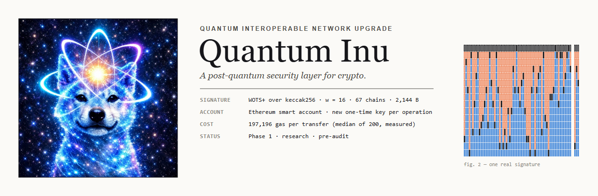
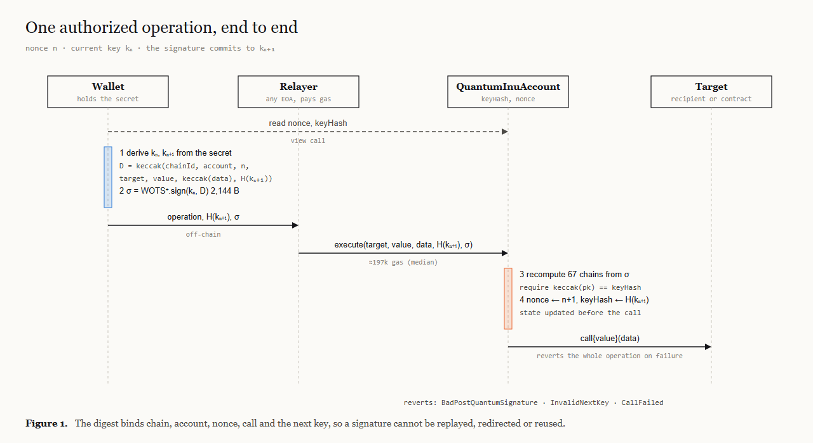
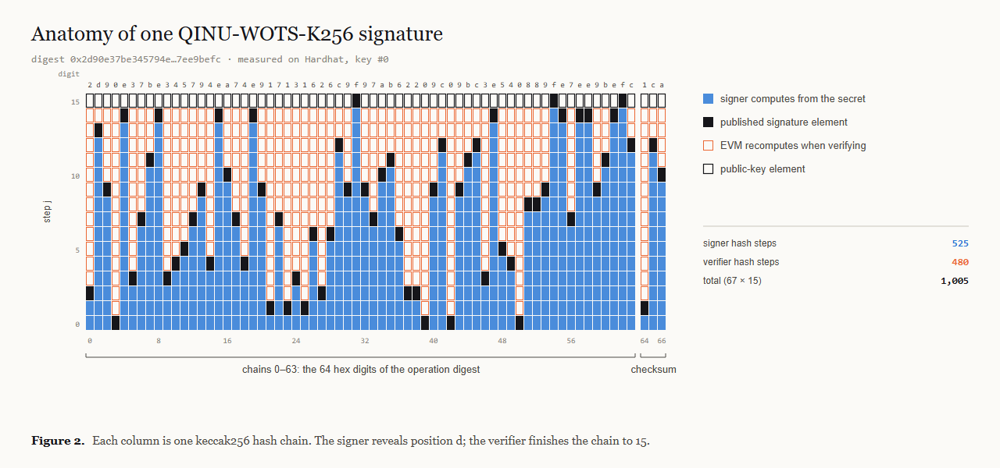
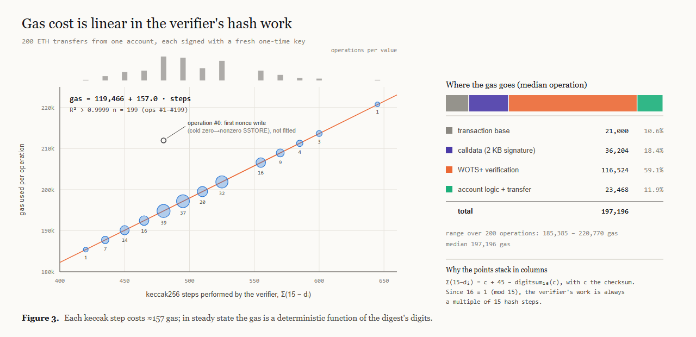
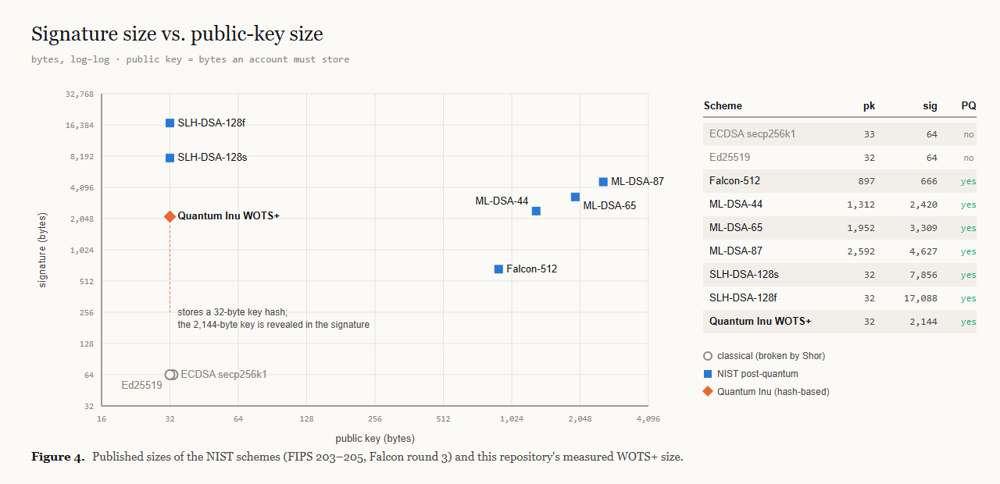

<p align="center">
  
</p>

<h1 align="center">Quantum Inu</h1>

<p align="center">
  <strong>Quantum Interoperable Network Upgrade</strong><br>
  <sub>Post-quantum authorization, migration policy, exposure analysis and multichain security research.</sub>
</p>

<p align="center">
  <code>Ethereum-native</code> ·
  <code>WOTS+</code> ·
  <code>Hybrid authorization</code> ·
  <code>Threat Sentinel</code> ·
  <code>Cross-language conformance</code> ·
  <code>Research / pre-audit</code>
</p>

---

## Overview

Quantum Inu is a research framework for migrating blockchain authorization toward post-quantum security without conflating account-level protection with chain-wide consensus migration.

The repository combines four layers:

1. **Authorization** — hash-based and hybrid smart-account authorization on Ethereum.
2. **Risk intelligence** — normalized observations, exposure scoring, migration urgency and reason codes.
3. **Evidence** — signed observations and deterministic evidence envelopes.
4. **Migration tooling** — capability negotiation, compatibility analysis and chain-specific migration planning.

The project intentionally separates implemented research components from planned chain-level integrations.

> **Status:** research / pre-audit. Do not treat this repository as production-ready cryptographic infrastructure.


---

## Authorization flow

<p align="center">
  
</p>

## System architecture

```text
                         ┌──────────────────────────┐
                         │      Quantum Inu Core    │
                         │ policy · evidence · PQC  │
                         └─────────────┬────────────┘
                                       │
              ┌────────────────────────┼────────────────────────┐
              │                        │                        │
              ▼                        ▼                        ▼
       Ethereum Account         Threat Sentinel         Observer Network
       + Hybrid Auth            + Risk Engine           + Evidence Signing
              │                        │                        │
              └────────────────────────┼────────────────────────┘
                                       ▼
                              Migration Coordinator
                                       │
                     ┌─────────────────┼────────────────┐
                     ▼                 ▼                ▼
                  Ethereum          Bitcoin           Solana
                  policy            policy            policy
```

---

## Security model

Quantum Inu models migration decisions around explicit evidence rather than a single boolean flag.

A normalized observation can include:

- public-key exposure state;
- exposure age;
- subject value at risk;
- signing frequency;
- key-reuse indicators;
- current signature family;
- available PQ authorization capabilities;
- chain upgrade latency;
- replay surface;
- account migration readiness.

The policy engine converts those signals into a deterministic score, urgency, action and ordered reason codes.

```text
observe
  ↓
normalize
  ↓
verify evidence
  ↓
score exposure
  ↓
negotiate capabilities
  ↓
plan migration
  ↓
emit deterministic decision
```

---

## Repository map

| Area | Purpose |
|---|---|
| `contracts/` | Solidity authorization, registries, rotation and verification |
| `crates/qinu-core/` | canonical observation and decision model |
| `crates/qinu-policy/` | deterministic migration scoring and policy evaluation |
| `crates/qinu-evidence/` | evidence envelopes, digests and verification |
| `crates/qinu-crypto/` | algorithm identifiers, capability sets and hash helpers |
| `services/threat-sentinel/` | Go service for normalized risk assessment |
| `services/observer-node/` | signed observation production |
| `services/migration-coordinator/` | migration plan generation |
| `sdk/python/` | Python SDK |
| `sdk/typescript/` | TypeScript SDK |
| `sdk/go/` | Go SDK |
| `sdk/rust/` | Rust SDK façade |
| `specs/schemas/` | machine-readable protocol schemas |
| `specs/test-vectors/` | cross-language conformance vectors |
| `benchmarks/` | deterministic benchmark harnesses |
| `tools/` | repository, conformance and security checks |
| `docs/quantum-inu/` | architecture, threat model, boundaries and audit scope |

---

## Implemented research components

- deterministic migration policy engine;
- structured reason codes and score breakdowns;
- capability registry and negotiation;
- evidence envelope hashing;
- Ethereum migration registry;
- hybrid authorization policy;
- key-rotation state machine;
- replay protection primitives;
- WOTS+ profile constants and test vectors;
- Go threat sentinel;
- signed observer envelope model;
- migration coordinator;
- Python, TypeScript, Go and Rust SDK surfaces;
- shared conformance vectors;
- fuzz/invariant-oriented Solidity tests;
- CI workflows for Rust, Go, Python, TypeScript and Solidity.

---

## Migration decision model

The canonical policy engine uses weighted, inspectable factors rather than opaque heuristics.

```text
risk =
    exposure_age_weight
  + value_at_risk_weight
  + signing_frequency_weight
  + key_reuse_weight
  + legacy_signature_weight
  + chain_upgrade_latency_weight
  + replay_surface_weight
  - pq_authorization_credit
  - hybrid_authorization_credit
```

The score is mapped to:

```text
LOW       monitor
MEDIUM    prepare-migration
HIGH      migrate
CRITICAL  isolate-and-migrate
```

Every decision carries machine-readable reason codes such as:

```text
PUBLIC_KEY_EXPOSED
EXPOSURE_AGE_HIGH
HIGH_VALUE_SUBJECT
HIGH_SPEND_FREQUENCY
KEY_REUSE_DETECTED
LEGACY_SIGNATURE_ONLY
CHAIN_UPGRADE_LATENCY_HIGH
REPLAY_SURFACE_PRESENT
PQ_AUTHORIZATION_AVAILABLE
HYBRID_AUTH_AVAILABLE
```

---

## Ethereum authorization research

<p align="center">
  
</p>

The Solidity layer contains:

- `QuantumInuAccount.sol`
- `HybridAuthorizer.sol`
- `KeyRotationManager.sol`
- `MigrationRegistry.sol`
- `CapabilityRegistry.sol`
- `EvidenceRegistry.sol`
- `WotsPlus.sol`

The account-level design is intentionally scoped. A post-quantum smart account does **not** make Ethereum consensus post-quantum.

> **Account-level post-quantum authorization ≠ consensus-layer migration.**

---


## Verification cost

<p align="center">
  
</p>

## Signature and public-key size

<p align="center">
  
</p>

## Cross-language conformance

The same JSON test vectors are consumed by Rust, Go, Python and TypeScript implementations.

That turns multi-language parity into a protocol requirement rather than duplicated business logic.

```text
specs/test-vectors/
├── observations.json
├── expected-assessments.json
├── capabilities.json
├── evidence-envelopes.json
└── migration-plans.json
```

Each SDK must agree on:

- urgency;
- action;
- score;
- reason-code ordering;
- capability negotiation result;
- canonical evidence digest.

---

## Threat Sentinel

The Go service is responsible for:

1. normalizing raw observations;
2. validating evidence shape;
3. applying the canonical policy profile;
4. returning a deterministic assessment;
5. emitting a migration recommendation;
6. preserving reason-code traceability.

It does not submit transactions and does not hold signing keys.

---

## Security boundaries

Quantum Inu explicitly does **not** claim:

- that Ethereum is quantum-resistant end-to-end;
- that Bitcoin script rules have been upgraded;
- that Solana consensus has replaced Ed25519;
- that the current contracts have been externally audited;
- that benchmark results represent production networks.

See:

- `docs/quantum-inu/THREAT_MODEL.md`
- `docs/quantum-inu/CHAIN_BOUNDARIES.md`
- `docs/quantum-inu/CRYPTOGRAPHIC_BOUNDARIES.md`
- `docs/quantum-inu/AUDIT_SCOPE.md`

---

## Development

### Rust

```bash
cargo test --workspace
```

### Go

```bash
go test ./...
```

### Python SDK

```bash
cd sdk/python
python -m pytest
```

### TypeScript SDK

```bash
cd sdk/typescript
npm install
npm test
```

### Solidity

```bash
cd contracts
forge test
```

### Repository invariants

```bash
python tools/repo_invariants.py
python tools/check_vectors.py
python tools/secret_scan.py
```

---

## Roadmap

| Phase | Scope | State |
|---|---|---|
| 1 | Canonical policy model, evidence envelopes, registries, SDK parity | implemented research |
| 2 | Ethereum authorization modules, fuzz/invariant testing, observer service | active |
| 3 | Standardized PQ verification experiments, ERC-4337 integration | planned |
| 4 | Bitcoin/Solana migration adapters and chain-specific coordination | research |

---

## Status

```text
project type          security research framework
audit                 not audited
production ready      no
external validation   pending
primary focus         migration policy + authorization research
```

## License

MIT
